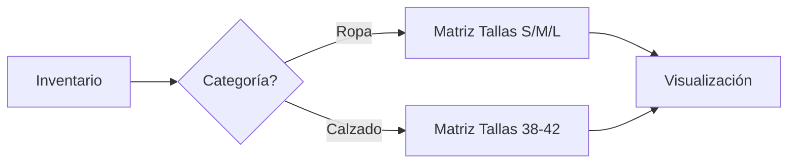

# Ejemplo: Matriz de Inventario

**Contexto**: El usuario pide una "matriz dinámica" para ropa y calzado.

**Preguntas del Agente**:

### 1. Visualización y "Sparse Matrix"
Dado que vendes Ropa (S, M, L) y Calzado (38, 40, 42):
- **Problema**: Si mostramos todo junto, tendremos columnas vacías cruzadas.
- **Pregunta**: ¿Prefieres vistas separadas por categoría o una vista general con huecos?

### 2. Casos Hipotéticos
- **Ordenamiento**: "10" vs "2". ¿Necesitamos lógica numérica o alfanumérica?
- **Productos Nuevos**: Si llega "XXL" que no existe, ¿la matriz añade la columna sola o requiere configuración previa?

### 3. Edición
- ¿Es solo lectura o editable tipo Excel?
